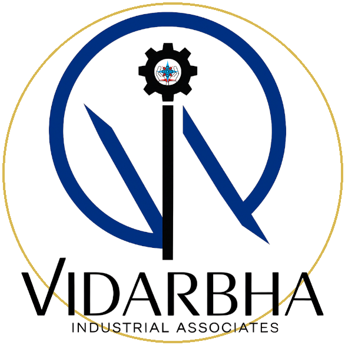
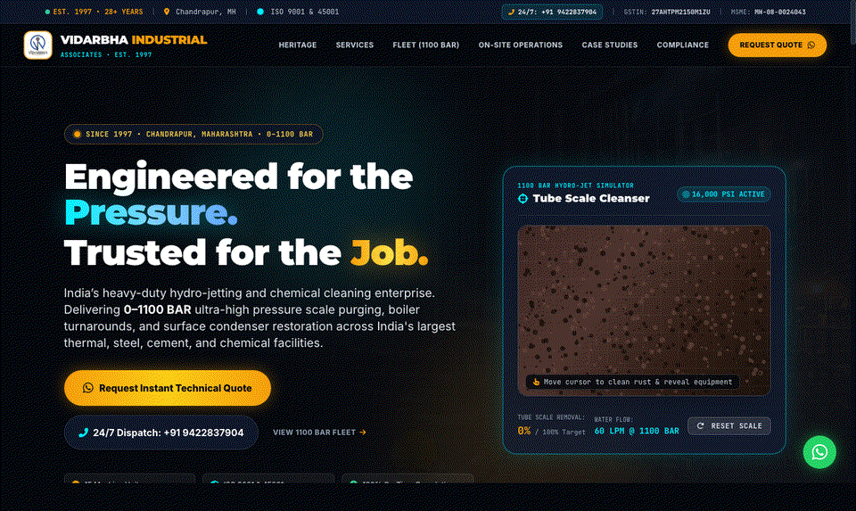
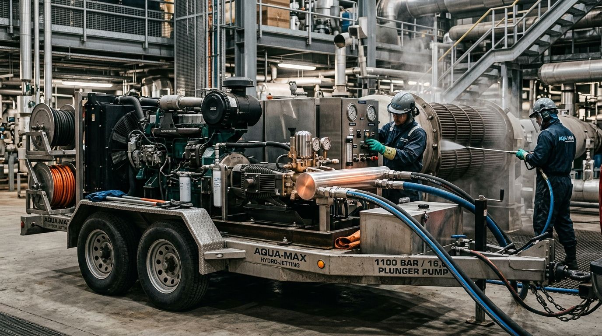
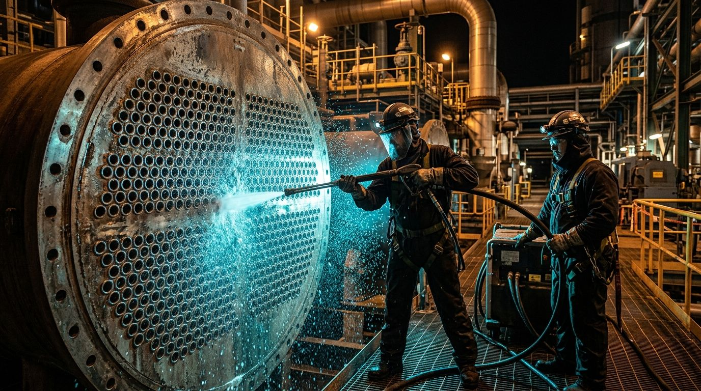
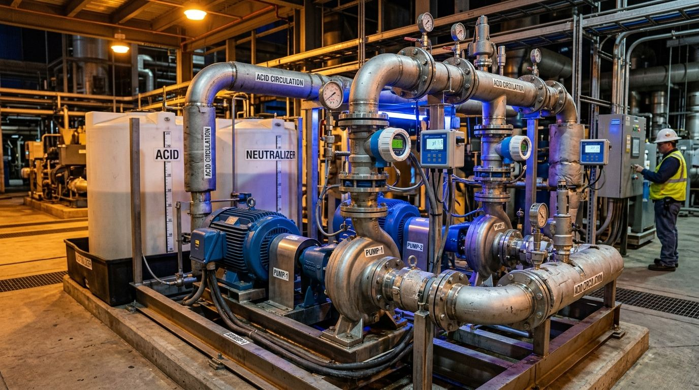
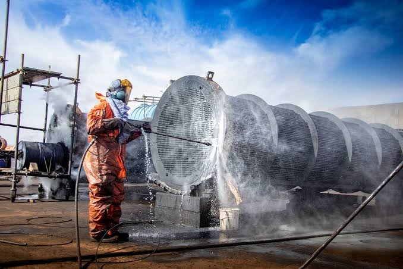

# Vidarbha Industrial Associates (VIA) — Official Web Platform

# VIDARBHA INDUSTRIAL ASSOCIATES
### Heavy Ultra-High Pressure (0–1100 BAR) Hydro-Jetting & Turnaround Engineering
*Established 1997 • Chandrapur, Maharashtra, India*

 

 

<!-- ==================== ANIMATED HERO SHOWCASE ==================== -->

  ⚡ <b>Live Platform Showcase:</b> Featuring the real-time 1100 BAR Hydro-Jet Scale Simulator, 41+ Client Marquee, and WhatsApp Technical Quotation Engine.

---

| ⏱️ Operational Heritage | 💥 Pressure Envelope | 🚜 Fleet Capacity | 🛡️ Safety Record |
| :---: | :---: | :---: | :---: |
| **28+ Years Continuous** Serving Indian Industry Since 1997 | **0 – 1,100 BAR (16,000 PSI)** Triplex Plunger Technology | **15 Specialized Units** Mobile Trailers, Trolleys & Skids | **100% Incident-Free** Zero Lost-Time Injuries (LTI) |

---

## 📌 Executive Summary

**Vidarbha Industrial Associates (VIA)** is a premier heavy turnaround and industrial cleaning contractor founded in **1997** in **Chandrapur, Maharashtra**—the strategic heart of India’s thermal power generation, coal mining, and metallurgical corridor.

Under the leadership of veteran Director **P.C. Mitra** and experienced turnaround engineers, VIA delivers turnkey **Ultra-High Pressure (UHP) Hydro-Jetting (up to 1,100 BAR / 16,000 PSI)**, chemical descaling, pre-commissioning pickling, and mission-critical plant turnarounds. Over nearly three decades of unbroken field execution, VIA has restored thermal heat rates, eliminated catastrophic tube fouling, and maximized operational uptime across India’s premier thermal power stations, integrated steel works, cement plants, and chemical process complexes.

---

## ⚡ Technical Specifications & Operating Envelope

| Engineering Parameter | Certified Specification | Target Industrial Application |
|---|---|---|
| **Peak Operating Pressure** | **0 – 1,100 BAR (16,000 PSI)** | Fused silica, baked-on coal tar, rock-hard magnetite & clinker scale |
| **Volumetric Flow Rates** | **35 – 120 LPM** | High-volume sludge purging, tube bundle flushing & rapid bore evacuation |
| **Prime Mover Power** | **15 HP to 120 HP (90 kW)** | Heavy-duty diesel power units & Flameproof (FLP) electric motors |
| **Lancing Assemblies** | **Rigid SS304 & Parker Flexible** | Surface condensers, economizers, air preheaters (APH) & superheaters |
| **Hydraulic Proof Testing** | **1,600 BAR Certified Proof** | Welkin India certified Parker Hannifin 4-spiral wire braid hoses |
| **Chemical Formulations** | **98.5% Inhibited Sulfamic Acid** | Multi-metal safe descaling, pickling, and chemical passivation |
| **Operator Ballistic PPE** | **2,000 BAR Rated Kevlar Armor** | Double-acting dead-man safety foot dump valves (FOV) & blast shields |

---

## 📸 Heavy Equipment Fleet & Field Operations

<table>
  <tr>
    <td width="50%" align="center">
        
      <b>🚜 1100 BAR Mobile Triplex Trailer Rig</b> 
      Heavy diesel-driven triplex plunger pump unit with stainless steel accumulator manifold for rapid site mobilization.
    </td>
    <td width="50%" align="center">
        
      <b>⚡ Precision Surface Condenser Descaling</b> 
      Ultra-high pressure rotary jetting of 10,000+ stainless steel tube sheets restoring condenser vacuum.
    </td>
  </tr>
  <tr>
    <td width="50%" align="center">
        
      <b>🧪 Chemical Descaling & Neutralization Skid</b> 
      Closed-loop acid circulation skid with continuous digital pH and temperature monitoring.
    </td>
    <td width="50%" align="center">
        
      <b>🛡️ Turnaround Field Hydro-Blasting</b> 
      Full ballistic-PPE certified field team executing turnaround cleaning on a massive plant tube bundle.
    </td>
  </tr>
</table>

---

## 🎯 Core Engineering Services

- **🔥 Ultra-High Pressure (UHP) Hydro-Jetting (0–1100 BAR)**  
  Mechanical pulverization of fused silica, magnetite, and hard scale from boiler tubes, heat exchangers, reboilers, and process pipelines with zero parent metal erosion.
- **🧪 Heavy Chemical Descaling & Pickling**  
  Formulated circulation cleaning using 98.5% inhibited sulfamic acid, citric acid, and chelating agents for complex internal geometries, heat exchangers, and jacketed vessels.
- **⚡ Supercritical Surface Condenser Overhaul**  
  De-choking and descaling of 10,000+ tube arrays in supercritical 660 MW power stations, directly restoring turbine backpressure and heat rate.
- **💨 Air Preheater (APH) & Economizer Lancing**  
  Multi-lance high-velocity rotary systems designed for rapid evacuation of fly ash, slag bridging, and stubborn flue gas fouling.
- **🔍 Non-Destructive Testing (NDT) & Tube Inspection**  
  Pre- and post-cleaning boroscopic video inspection, ultrasonic thickness gauging, and eddy current tube condition reporting.
- **🚨 24/7 Emergency Outage Rapid Dispatch**  
  Mobilization of dedicated trailer units and certified turnaround teams within 2 hours across Maharashtra, Chhattisgarh, and Madhya Pradesh.

---

## 🏢 Trusted by 41+ Heavy Industrial Leaders

| Sector | Marquee Industrial Clients |
|---|---|
| **⚡ Power Generation** | **Tata Power** • **Mahagenco** • **Adani Power** • **KSK Mahanadi** • **Wardha Power** • **Lanco Infratech** |
| **🏭 Integrated Steel** | **JSW Steel** • **Shyam Metalics** • **Sanvijay Alloys** • **Godavari Engineering** • **Rungta Mines** • **Visa Steel** |
| **🏗️ Cement & Clinker** | **UltraTech Cement** • **ACC Cement** • **Ambuja Cements** • **Manikgarh Cement** • **Orient Cement** |
| **⛏️ Mining & Infrastructure** | **Lloyds Metals & Energy** • **Western Coalfields (WCL)** • **Mahindra & Mahindra** • **MIDC Industrial Zones** |
| **🧪 Process & Paper** | **Indorama Synthetics** • **Chembond Chemicals** • **Emami Paper Mills** • **Surya Roshni** |

---

## 🛡️ Statutory Accreditations & Safety Matrix

VIA enforces an uncompromising safety regime certified to national and global standards:

- **Quality Standard:** **ISO 9001:2015 Certified** (Quality Management System for Industrial Cleaning & Hydro-Jetting)
- **Safety Standard:** **ISO 45001:2018 Certified** (Occupational Health & Safety Management Systems)
- **Government of India MSME:** **UDYAM-MH-08-0024043** (Registered Enterprise)
- **Goods & Services Tax:** **GSTIN: 27AHTPM2150M1ZU**
- **Safety Rigging:** Welkin India hydraulic proof certified to **1,600 BAR**, Parker Hannifin 4-spiral wire braid hoses, 2,000 BAR ballistic Kevlar operator armor, and dual-action dead-man safety foot dump valves (FOV).
- **Statutory Labor Compliance:** 100% compliant with the Indian Factories Act, ESIC, EPF, and comprehensive Workman’s Compensation insurance.

---

## 💻 Web Platform Features

- **🎮 Interactive 1100 BAR Hydro-Jet Simulator:** Canvas-based 60 FPS simulator allowing engineers to experience high-pressure scale removal and equipment restoration in real time.
- **📲 Direct WhatsApp Engineering Dispatch:** Formulated inquiry engine that compiles plant specifications (pressure tier, service scope, equipment size) into a structured technical dispatch directly to Director P.C. Mitra (+91 9422837904).
- **⚡ Sub-Second Zero-Dependency Architecture:** Engineered with pure HTML5, Tailwind CSS, and Vanilla ES6 JavaScript—achieving 99+ Google Lighthouse scores, instant loading, and zero maintenance overhead.
- **🌐 Cloud Production Verified:** Pre-configured with `vercel.json` for edge caching, strict security headers (CSP, X-Frame-Options), and automated XML sitemaps.

---

## 📍 Corporate Headquarters & 24/7 Operations Line

### VIDARBHA INDUSTRIAL ASSOCIATES
**Headquarters & Central Equipment Depot**  
Maya Decoration, Nr Durga Mata Mandir, Bye Pass Road,  
Bengali Camp Market, Chandrapur - 442401, Maharashtra, India  

📞 **24/7 Dispatch Hotline:** `+91 9422837904` / `+91 9770215590`  
💬 **Direct WhatsApp:** [Chat with Director P.C. Mitra](https://wa.me/919422837904?text=Hello%20VIA,%20requesting%20technical%20consultation)  
✉️ **Email:** `via.industrial.services@gmail.com`

---

<b>🔧 Technical Deployment & Repository Notes</b>

 

- **Framework:** Zero-dependency Static HTML5 / Vanilla ES6 / Tailwind CSS
- **Live Repository:** [https://github.com/ronniee96/VIA-web](https://github.com/ronniee96/VIA-web)
- **Production Host:** Vercel Edge Network (`cleanUrls: true`, asset caching headers)
- **Local Preview:** `python3 -m http.server 8080` or simply open `index.html` in any browser.

 

&copy; 1997–2026 Vidarbha Industrial Associates. All rights reserved. | ISO 9001:2015 & ISO 45001:2018 Certified Enterprise

